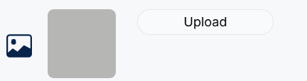

# Developer Guide: Reusable Components

This guide explains how to use the reusable components in this folder. These components are designed to streamline development and maintain consistency across the application.

---

Table of Content

- [Developer Guide: Reusable Components](#developer-guide-reusable-components)
  - [ColorPicker](#colorpicker)
    - [Purpose](#purpose)
    - [Props](#props)
    - [Usage Example](#usage-example)
    - [Preview](#preview)
    - [How It Works](#how-it-works)
    - [Notes](#notes)
  - [ComponentDivider](#componentdivider)
    - [Purpose](#purpose-1)
    - [Props](#props-1)
    - [Usage Example](#usage-example-1)
    - [Preview](#preview-1)
  - [ComponentIcon](#componenticon)
    - [Purpose](#purpose-2)
    - [Props](#props-2)
    - [Usage Example](#usage-example-2)
    - [How It Works](#how-it-works-1)
    - [Notes](#notes-1)
  - [EditorDivider](#editordivider)
    - [Purpose](#purpose-3)
    - [Props](#props-3)
    - [Usage Example](#usage-example-3)
    - [Preview](#preview-2)
  - [FillUpControl](#fillupcontrol)
    - [Purpose](#purpose-4)
    - [Props](#props-4)
    - [Usage Example](#usage-example-4)
    - [Preview](#preview-3)
    - [How It Works](#how-it-works-2)
    - [Notes](#notes-2)
  - [FontSelector](#fontselector)
    - [Purpose](#purpose-5)
    - [Props](#props-5)
    - [Usage Example](#usage-example-5)
    - [Preview](#preview-4)
    - [How It Works](#how-it-works-3)
  - [ImageUploader](#imageuploader)
    - [Purpose](#purpose-6)
    - [Props](#props-6)
    - [Usage Example](#usage-example-6)
    - [Preview](#preview-5)
      - [With Image](#with-image)
      - [Without Image](#without-image)
    - [How It Works](#how-it-works-4)
  - [LinkSelector](#linkselector)
    - [Purpose](#purpose-7)
    - [Props](#props-7)
    - [Usage Example](#usage-example-7)
    - [Preview](#preview-6)
    - [How It Works](#how-it-works-5)
  - [SizeSlider](#sizeslider)
    - [Purpose](#purpose-8)
    - [Props](#props-8)
    - [Usage Example](#usage-example-8)
    - [Preview](#preview-7)
    - [How It Works](#how-it-works-6)
    - [Notes](#notes-3)
  - [TextInput](#textinput)
    - [Purpose](#purpose-9)
    - [Props](#props-9)
    - [Usage Example](#usage-example-9)
      - [Singleline TextInput With Full Functionality](#singleline-textinput-with-full-functionality)
      - [TextInput Without Style Change](#textinput-without-style-change)
    - [Preview](#preview-8)
      - [Single Line](#single-line)
      - [Multiple Line](#multiple-line)
    - [How It Works](#how-it-works-7)
  - [TextSizeSelector](#textsizeselector)
    - [Purpose](#purpose-10)
    - [Props](#props-10)
    - [Usage Example](#usage-example-10)
      - [Preview](#preview-9)
    - [How It Works](#how-it-works-8)
  - [TextSizeSelectorWithIcon](#textsizeselectorwithicon)
    - [Overview](#overview)
    - [Props](#props-11)
    - [Usage Example](#usage-example-11)
      - [Preview](#preview-10)
    - [How It Works](#how-it-works-9)
  - [Toolbar](#toolbar)
    - [Overview](#overview-1)
    - [Props](#props-12)
    - [Usage Example](#usage-example-12)
    - [How It Works](#how-it-works-10)

---

## ColorPicker

### Purpose

A reusable color picker component that allows users to select a color using the `SketchPicker` from `react-color`. The selected color is displayed as a circular preview button, and the color picker appears in a modal for selection when the button is clicked.

Used in the [TextInput](./TextInput.tsx) component and [FillUpControl](./FillUpControl.tsx) component (Check the related files for examples).

---

### Props

| Prop Name  | Type     | Required | Default Value | Description                                                 |
| ---------- | -------- | -------- | ------------- | ----------------------------------------------------------- |
| `color`    | string   | Yes      | None          | The currently selected color                                |
| `onChange` | Function | Yes      | None          | A callback function triggered when a new color is selected. |

---

### Usage Example

```tsx
import React, { useState } from 'react';
import ColorPicker from './path/to/ColorPicker';

const Example = () => {
  const [selectedColor, setSelectedColor] =
    useState<string>('rgba(255, 0, 0, 1)');

  return (
    <div className="flex flex-col items-center">
      <h1 style={{ color: selectedColor }}>Preview Text</h1>
      <ColorPicker
        color={selectedColor}
        onChange={(color: string) => setSelectedColor(color)}
      />
    </div>
  );
};

export default Example;
```

---

### Preview


---

### How It Works

1. **Color Preview Button**:

   - The `color` prop determines the background color of the circular preview button.
   - Clicking the button toggles the modal visibility.

2. **Modal Behavior**:

   - The modal opens when the preview button is clicked.
   - The color picker appears in a positioned container below the preview button.
   - Clicking outside the modal closes it.

3. **Color Selection**:

   - The `SketchPicker` component allows users to select a color.
   - The `onChange` callback is triggered with the selected color in `rgba` format.

4. **Utility Functions**:
   - `rgbaToString(rgb)`: Converts an `RGBColor` object to an `rgba` string.

---

### Notes

- This component uses [react-color](./https://casesandberg.github.io/react-color/#api-color) library. For the color value, it accepts either a string of a hex color '#333' or a object of rgb or hsl values { r: 51, g: 51, b: 51 } or { h: 0, s: 0, l: .10 }. Both rgb and hsl will also take a a: 1 value for alpha. You can also use transparent.

## ComponentDivider

### Purpose

A simple horizontal divider for seperating the component. Use it to ensure consistency in UI design.

### Props

| Prop Name | Type   | Required | Default Value | Description                                              |
| --------- | ------ | -------- | ------------- | -------------------------------------------------------- |
| `style`   | string | No       | `""`          | Additional Tailwind CSS styles to customize the divider. |

### Usage Example

```tsx
import ComponentDivider from './path/to/ComponentDivider';

const Example = () => (
  <div>
    <ComponentDivider />
  </div>
);
```

---

### Preview


## ComponentIcon

### Purpose

A reusable icon component that simplifies the integration of icons with customizable styles, colors, and click functionality. This component is designed to streamline the use of icons in React applications while ensuring consistency and flexibility.

Used in almost every component to ensure consistent layout.

---

### Props

| Prop Name         | Type              | Required | Default Value | Description                                                             |
| ----------------- | ----------------- | -------- | ------------- | ----------------------------------------------------------------------- |
| `icon`            | React.ElementType | Yes      | None          | The icon component to render (e.g., from a library like `react-icons`). |
| `divStyle`        | string            | No       | `""`          | Additional custom styles for the outer `div` container.                 |
| `onClickFunction` | Function          | No       | None          | A callback function triggered when the icon is clicked.                 |
| `color`           | string            | No       | `"#09244B"`   | The color of the icon.                                                  |
| `size`            | number            | No       | None          | The size of the icon (in pixels).                                       |

---

### Usage Example

```tsx
import ComponentIcon from './path/to/ComponentIcon';
import { FaHome } from 'react-icons/fa';

const Example = () => (
  <ComponentIcon
    icon={FaHome}
    size={30}
    color="red"
    onClickFunction={() => console.log('Icon clicked!')}
  />
);
```

---

### How It Works

1. **Icon Rendering**:

   - The `icon` prop specifies the React element to render as the icon (e.g., from `react-icons`).
   - It supports additional customization using props like `color` and `size`.

2. **Click Functionality**:

   - If the `onClickFunction` prop is provided, the outer container gains a `cursor-pointer` style.
   - The function is passed to the icon's `onClick` event handler.

3. **Styling**:

   - Additional styles can be passed using the `divStyle` prop.

4. **Default Behavior**:
   - If no `size` is specified, the icon defaults to its inherent size.
   - If no `color` is provided, the default color is `#09244B`.

---

### Notes

- Ensure that the `icon` prop is a valid React component (e.g., imported from `react-icons` or similar libraries).

## EditorDivider

### Purpose

A customizable vertical divider with rounded edges, useful for separating UI elements in an editor interface.

### Props

| Prop Name | Type   | Required | Default Value | Description                                                           |
| --------- | ------ | -------- | ------------- | --------------------------------------------------------------------- |
| `style`   | string | No       | `""`          | Additional Tailwind CSS styles to customize the divider's appearance. |

### Usage Example

```tsx
import EditorDivider from './path/to/EditorDivider';

const Example = () => (
  <div className="flex items-center">
    <EditorDivider style="mx-4 h-[50px]" />
  </div>
);
```

---

### Preview


## FillUpControl

### Purpose

A reusable control component for enabling or disabling a "Fill up" feature, along with a color picker for customization. This component is particularly useful in design or graphic editor applications.

---

### Props

| Prop Name         | Type     | Required | Default Value | Description                                                  |
| ----------------- | -------- | -------- | ------------- | ------------------------------------------------------------ |
| `isFillUpChecked` | boolean  | Yes      | None          | Indicates whether the "Fill up" switch is toggled on or off. |
| `color`           | string   | Yes      | None          | Current fill color (e.g., in `rgba` or `hex` format).        |
| `onSwitchChange`  | Function | Yes      | None          | Callback function triggered when the switch state changes.   |
| `onColorChange`   | Function | Yes      | None          | Callback function triggered when the color value is updated. |

---

### Usage Example

```tsx
import React, { useState } from 'react';
import FillUpControl from './path/to/FillUpControl';

const Example = () => {
  const [isButtonFillUpChecked, setIsButtonFillUpChecked] =
    React.useState(true);

  const handleButtonFillUpSwitchChange = (
    event: React.ChangeEvent<HTMLInputElement>
  ) => {
    setIsButtonFillUpChecked(event.target.checked);
    if (!event.target.checked) {
      setTempProps('buttonColor', 'transparent');
    } else {
      setTempProps('buttonColor', '#fff');
    }
  };

  return (
    <FillUpControl
      isFillUpChecked={isButtonFillUpChecked}
      color={tempProps.buttonColor}
      onSwitchChange={handleButtonFillUpSwitchChange}
      onColorChange={(color: string) => {
        setTempProps('buttonColor', color);
      }}
    />
  );
};
```

---

### Preview


---

### How It Works

1. **Icon Display**:

   - The component uses the `FaFillDrip` icon from `react-icons` to visually represent the fill-up feature.
   - The icon size is customizable within the `ComponentIcon` wrapper.

2. **Switch Control**:

   - A `Switch` from `@mui/material` toggles the `isFillUpChecked` state.
   - The `onSwitchChange` callback captures the state change and propagates it to the parent component.

3. **Color Picker**:
   - When `isFillUpChecked` is `true`, the `ColorPicker` is displayed, allowing users to select a fill color.
   - The `onColorChange` callback propagates the updated color value to the parent component.

---

### Notes

- The `ColorPicker` accept valid color formats (`rgba`, `hex`, etc.) for seamless integration. See [ColorPicker](./ColorPicker.tsx) for more detail.

## FontSelector

### Purpose

A reusable font selector component that allows users to preview and select fonts. The selected font is displayed as the preview button, and a list of fonts appears in a modal for selection.

Used in the [TextInput](./TextInput.tsx) component.

---

### Props

| Prop Name      | Type     | Required | Default Value | Description                                                 |
| -------------- | -------- | -------- | ------------- | ----------------------------------------------------------- |
| `font`         | string   | Yes      | None          | The currently selected font, applied to the preview button. |
| `onFontChange` | Function | Yes      | None          | A callback function triggered when a font is selected.      |

---

### Usage Example

```tsx
import FontSelector from './path/to/FontSelector';
import React, { useState } from 'react';

const Example = () => {
  const [selectedFont, setSelectedFont] =
    useState<string>('Roboto, sans-serif');

  const handleFontChange = (font: string) => {
    console.log(`Selected Font: ${font}`);
    setSelectedFont(font);
  };

  return (
    <div className="flex flex-col items-center">
      <h1 style={{ fontFamily: selectedFont }}>Preview Text</h1>
      <FontSelector font={selectedFont} onFontChange={handleFontChange} />
    </div>
  );
};

export default Example;
```

---

### Preview


---

### How It Works

1. **Preview Button**: The `font` prop determines the font family applied to the preview button.
2. **Modal Behavior**:
   - Opens when the preview button is clicked.
   - Displays the available fonts as a row of "A" elements styled with each font.
   - Closes when a font is selected or the user clicks outside the modal.
3. **Font Selection**: The `onFontChange` callback is triggered with the selected font's family name.

## ImageUploader

### Purpose

A reusable component for uploading images, with an optional preview feature. Users can customize the upload button's icon and manage the uploaded image.

---

### Props

| Prop Name       | Type                                                   | Required | Default Value | Description                                                                       |
| --------------- | ------------------------------------------------------ | -------- | ------------- | --------------------------------------------------------------------------------- |
| `image`         | `string \| null`                                       | Yes      | `null`        | The URL of the uploaded image. Displays a preview if available.                   |
| `onImageChange` | `(event: React.ChangeEvent<HTMLInputElement>) => void` | Yes      | None          | Callback function triggered when the user uploads a new image.                    |
| `imageName`     | `string`                                               | Yes      | None          | The name used for the input's `id` attribute. Links the label to the input field. |
| `icon`          | `React.ElementType`                                    | No       | `BsImage`     | A custom icon for the upload button. Defaults to the `BsImage` icon.              |

---

### Usage Example

```tsx
import React, { useState } from 'react';
import ImageUploader from './path/to/ImageUploader';

const Example = () => {
  const [file, setFile] = useState<string | undefined>(image);
  const handleImageChange = (e: React.ChangeEvent<HTMLInputElement>) => {
    const selectedFile = e.target.files?.[0];
    if (selectedFile) {
      const imageUrl = URL.createObjectURL(selectedFile);
      setFile(imageUrl);
      setTempProps('image', imageUrl);
    }
  };

  return (
    <div>
      <h2>Image Uploader Example</h2>
      <ImageUploader
        image={tempProps.image}
        onImageChange={handleImageChange}
        imageName="file-upload"
      />
    </div>
  );
};

export default Example;
```

---

### Preview

#### With Image



#### Without Image


---

### How It Works

1. **Image Preview**:
   - If image is provided, a preview is displayed.
   - If the image fails to load, the preview automatically switches to a placeholder image.
2. **Upload Input**:
   - A hidden file input is controlled via the label for a seamless user experience.
   - When an image is uploaded, the `onImageChange` function processes the file and updates the state.
3. **Custom Icon**:
   - The `icon` prop allows passing any valid React icon component.
   - If no icon is provided, the default icon (`BsImage`) is used.

## LinkSelector

### Purpose

A component for selecting between different link types (URL or Subpage), with an input field for specifying the target link.

Note: This conponment can't select subpage right now since other subpages are still under developing.

---

### Props

| Prop Name     | Type       | Required | Default Value | Description                                                                             |
| ------------- | ---------- | -------- | ------------- | --------------------------------------------------------------------------------------- |
| `linkType`    | `string`   | Yes      | None          | The current selected link type. It could be either `"URL"` or `"Subpage"`.              |
| `setLinkType` | `Function` | Yes      | None          | Callback function to update the `linkType` state when the user selects a new link type. |
| `url`         | `string`   | Yes      | None          | The current URL or Subpage reference.                                                   |
| `setUrl`      | `Function` | Yes      | None          | Callback function to update the `url` state when the user types in the input field.     |

---

### Usage Example

```tsx
import React, { useState } from 'react';
import LinkSelector from './path/to/LinkSelector';

const Example = () => {
  const [linkType, setLinkType] = useState<string>('URL');

  return (
    <div>
      <h2>Link Selector Example</h2>
      <LinkSelector
        linkType={linkType}
        setLinkType={setLinkType}
        url={tempProps.url}
        setUrl={(url: string) => setTempProps('url', url)}
      />
    </div>
  );
};

export default Example;
```

---

### Preview


---

### How It Works

1. **Link Type Selection**:
   - The `linkType` state determines which radio button is selected. It toggles between `"URL"` and `"Subpage"`.
   - The `setLinkType` function updates the `linkType` state whenever the user selects a different option.
2. **Input Field**:
   - An input field allows the user to enter a URL or Subpage reference. The input value is bound to the `url state`.
   - The `setUrl` function updates the `url` state when the user types in the input.

## SizeSlider

### Purpose

A reusable size slider component that allows users to adjust a numeric value using a slider. It provides additional functionality to display the size value and optionally disable manual input.

---

### Props

| Prop Name  | Type     | Required | Default Value | Description                                                     |
| ---------- | -------- | -------- | ------------- | --------------------------------------------------------------- |
| `size`     | number   | Yes      | None          | The current size value displayed and adjusted using the slider. |
| `onChange` | Function | Yes      | None          | A callback function triggered when the slider value is changed. |
| `min`      | number   | No       | `1`           | The minimum value for the slider.                               |
| `max`      | number   | No       | `10`          | The maximum value for the slider.                               |
| `disabled` | boolean  | No       | `true`        | Disables manual input of the size value when set to `true`.     |

---

### Usage Example

```tsx
import React, { useState } from 'react';
import SizeSelector from './path/to/SizeSelector';

const Example = () => {
  return (
    <div>
      <h2>Size Selector Example</h2>
      <SizeSelector
        size={tempProps.size}
        onChange={(size: number) => setTempProps('size', size)}
        min={1}
        max={10}
      />
    </div>
  );
};

export default Example;
```

---

### Preview


---

### How It Works

1. **Slider Control**:
   - The `Slider` component from `@mui/material` allows users to adjust the numeric `size` value within the specified `min` and `max` range.
   - The `onChange` callback is invoked when the slider value changes, passing the new value to the parent component.
2. **Manual Input**:
   - Displays the current `size` value in an input field.
   - The input field is disabled by default but can be enabled by setting `disabled` to `false`.
3. **Default Behavior**:
   - The slider defaults to a `min` value of `1` and a `max` value of `10`.
   - Manual input is disabled unless explicitly enabled by the `disabled` prop.

---

### Notes

- Ensure the `size` prop is within the specified `min` and `max` range to avoid unexpected behavior.

## TextInput

### Purpose

A reusable and customizable text input component that supports additional features like font selection, text color picking, and background color picking. This component can be used in rich text editors or input forms.

---

### Props

| Prop Name                 | Type              | Required | Default Value | Description                                                              |
| ------------------------- | ----------------- | -------- | ------------- | ------------------------------------------------------------------------ |
| `icon`                    | React.ElementType | No       | `RxText`      | Icon displayed beside the input field.                                   |
| `placeholder`             | string            | Yes      | None          | Placeholder text for the input field.                                    |
| `value`                   | string            | Yes      | None          | The current value of the input field.                                    |
| `onChange`                | Function          | Yes      | None          | Callback function triggered when the value of the input field changes.   |
| `colorValue`              | string            | No       | None          | Current text color value (e.g., in `rgba` format).                       |
| `onColorChange`           | Function          | No       | None          | Callback function triggered when the text color is updated.              |
| `allowStyleChange`        | boolean           | No       | `true`        | Whether to enable styling options like font, text color, and background. |
| `font`                    | string            | No       | None          | The currently selected font for the input text.                          |
| `onFontChange`            | Function          | No       | None          | Callback function triggered when the font is updated.                    |
| `backgroundColorValue`    | string            | No       | None          | Current background color value (e.g., in `rgba` format).                 |
| `onBackgroundColorChange` | Function          | No       | None          | Callback function triggered when the background color is updated.        |
| `muitiline`               | boolean           | No       | `false`       | Whether the input should render as a multiline textarea.                 |

---

### Usage Example

#### Singleline TextInput With Full Functionality

```tsx
import React, { useState } from 'react';
import TextInput from './path/to/TextInput';

const Example = () => {
  return (
    <div>
      <TextInput
        placeholder="Top Text"
        value={tempProps.topContent}
        onChange={(value: string) => setTempProps('topContent', value)}
        colorValue={tempProps.topFontColor}
        onColorChange={(color: string) => setTempProps('topFontColor', color)}
        font={tempProps.topFont}
        onFontChange={(font: string) => setTempProps('topFont', font)}
        backgroundColorValue={tempProps.topTextBackgroundColor}
        onBackgroundColorChange={(color: string) =>
          setTempProps('topTextBackgroundColor', color)
        }
      />
    </div>
  );
};

export default Example;
```

#### TextInput Without Style Change

```tsx
import React, { useState } from "react";
import TextInput from "./path/to/TextInput";

const Example = () => {

  return (
    <div>
      <TextInput
        placeholder="Top Text"
        value={tempProps.topContent}
        onChange={(value: string) => setTempProps("topContent", value)}
        allowStyleChange={false} {/* Optional */}
      />
    </div>
  );
};

export default Example;
```

---

### Preview

#### Single Line


#### Multiple Line


---

### How It Works

1. **Icon Display**: The `icon` prop determines the icon displayed next to the input field. Defaults to `RxText`.
2. **Text Input or Textarea**: If the `muitiline` prop is set to `true`, the component renders a `textarea` instead of an `input`.
3. **Styling Options**:
   - The `allowStyleChange` prop enables or disables font, text color, and background color styling.
   - Includes `FontSelector` for font selection.
   - Includes `ColorPicker` for text and background color adjustments.
4. **Callbacks**:
   - The `onChange` callback is triggered whenever the text changes.
   - Styling-related callbacks (`onFontChange`, `onColorChange`, `onBackgroundColorChange`) update the respective styles dynamically.

## TextSizeSelector

### Purpose

A component for selecting and adjusting the font size from a predefined set of sizes. It provides radio buttons for different font sizes and allows the user to select one, which is then reflected in the parent component.

Used in the [TextSizeSelectorWithIcon](./TextSizeSelectorWithIcon.tsx) component. The difference between two is one include an icon and one without.

---

### Props

| Prop Name     | Type       | Required | Default Value | Description                                                                                                   |
| ------------- | ---------- | -------- | ------------- | ------------------------------------------------------------------------------------------------------------- |
| `fontSize`    | `number`   | Yes      | None          | The current font size selected. This controls the visual size of the text.                                    |
| `setFontSize` | `Function` | Yes      | None          | Callback function triggered when the font size is changed. It receives the selected font size as a parameter. |

---

### Usage Example

```tsx
import TextSizeSelector from './path/to/TextSizeSelector';

const Example = () => {
  return (
    <div>
      <h2>Text Size Selector Example</h2>
      <TextSizeSelector
        fontSize={tempProps.fontSize}
        setFontSize={(size: number) => setTempProps('fontSize', size)}
      />
      <p style={{ fontSize: tempProps.fontSize }}>
        This is a sample text with dynamic font size.
      </p>
    </div>
  );
};

export default Example;
```

---

#### Preview


---

### How It Works

1. **Radio Buttons**:  
   Each radio button represents a predefined font size (`Small`, `Medium`, `Large`, `Extra Large`). When the user selects a radio button, the `setFontSize` function is triggered to update the font size.

2. **Font Size Application**:  
   The `fontSize` prop reflects the currently selected font size. This value is used by the parent component to dynamically update the size of the text or other elements.

## TextSizeSelectorWithIcon

### Overview

This component is a combination of an icon and a text size selection interface. It allows users to choose a font size for their text.

It is [TextSizeSelector](./TextSizeSelectorWithIcon.tsx) with an icon.

---

### Props

| Prop Name     | Type       | Required | Description                                                                 |
| ------------- | ---------- | -------- | --------------------------------------------------------------------------- |
| `fontSize`    | `number`   | Yes      | Represents the current font size. Used to display the selected size option. |
| `setFontSize` | `Function` | Yes      | Function to update the font size based on the user's selection.             |

### Usage Example

```tsx
import TextSizeSelectorWithIcon from './path/to/TextSizeSelectorWithIcon';

const Example = () => {
  return (
    <div>
      <TextSizeSelectorWithIcon
        fontSize={tempProps.fontSize}
        setFontSize={(size: number) => setTempProps('fontSize', size)}
      />
      <p style={{ fontSize: tempProps.fontSize }}>
        This is a sample text with dynamic font size.
      </p>
    </div>
  );
};

export default Example;
```

---

#### Preview


---

### How It Works

1. **Radio Buttons**:  
   Each radio button represents a predefined font size (`Small`, `Medium`, `Large`, `Extra Large`). When the user selects a radio button, the `setFontSize` function is triggered to update the font size.

2. **Font Size Application**:  
   The `fontSize` prop reflects the currently selected font size. This value is used by the parent component to dynamically update the size of the text or other elements.

## Toolbar

### Overview

The `Toolbar` component provides a set of actions (Copy, Delete, Move Up, and Move Down) for managing text or other components in an editor-like interface.

---

### Props

| **Prop Name** | **Type**     | **Required** | **Description**                                                                        |
| ------------- | ------------ | ------------ | -------------------------------------------------------------------------------------- |
| `onCopy`      | `() => void` | Yes          | Function to handle the copy action.                                                    |
| `onDelete`    | `() => void` | Yes          | Function to handle the delete action. A confirmation dialog is shown before executing. |
| `onMoveUp`    | `() => void` | Yes          | Function to handle moving the component up in the list/order.                          |
| `onMoveDown`  | `() => void` | Yes          | Function to handle moving the component down in the list/order.                        |

---

### Usage Example

```tsx
import Toolbar from "./path/to/Toolbar";

const Example = () => {
  return (
    {/* Text Configuration */}
    <div className="flex bg-white rounded-xl shadow-lg mt-6">
      {/* Tool Bar */}
      <Toolbar
        onCopy={() => {}}
        onDelete={() => {actions.delete(id)}}
        onMoveUp={() => {}}
        onMoveDown={() => {}}
      />

      {/* Text Settings */}
      <div className="flex flex-col w-full h-full p-4 justify-center">
        {/* Text Input */}
        <TextInput
          placeholder="Text"
          value={tempProps.content}
          onChange={(value: string) => setTempProps("content", value)}
          colorValue={tempProps.fontColor}
          onColorChange={(color: string) => setTempProps("fontColor", color)}
          font={tempProps.font}
          onFontChange={(color: string) => setTempProps("font", color)}
        />
      </div>
    </div>
  );
};

export default ExampleApp;
```

### How It Works

1. **Delete Confirmation**

- Before deleting, the `onClickDelete` function shows a confirmation dialog using `window.confirm`.
- The action proceeds only if the user confirms.

1. **Action Buttons**

- **Copy:** Triggers the `onCopy` function.
- **Delete:** Triggers the `onDelete` function after user confirmation.
- **Move Up/Down:** Calls the respective `onMoveUp` or `onMoveDown` functions.

1. **Styling**

- The toolbar is styled as a vertically arranged group of buttons using `flex` layout utilities.
- Buttons are wrapped with MUI's `IconButton` for consistent accessibility and material design compliance.
- A background color (`#E6EAF1`) and rounded edges are applied for aesthetics.
